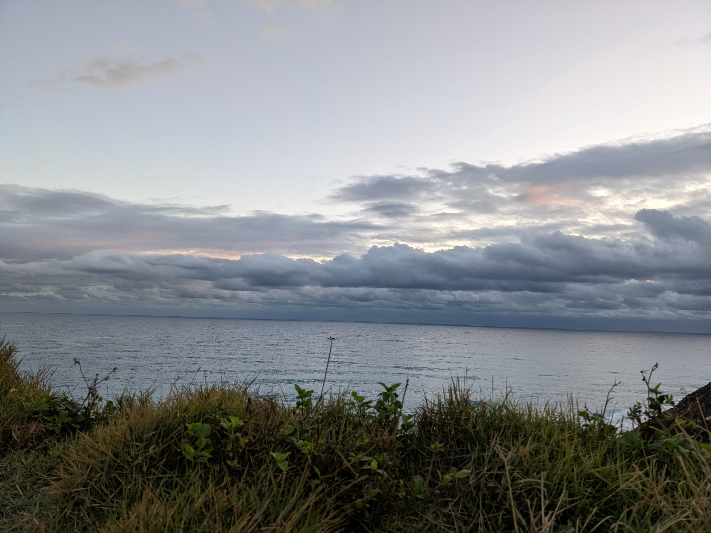

# 部落格的一開始

## 寫在一開始

雅姐與小優一開始只是有意無意地偶爾分享彼此生活瑣事(或說是鬼故事?)，這些事實在太有趣，決定用文字來記錄這些簡單卻又不簡單的生活記事。

## 地味 じみ (Ji Mi)

地味是日文漢字，指平凡、日常、不起眼

2022的第一天去了花東，不意外東部的冬日很難見到曙光

從社畜生活登出一年多，眼前的多雲似乎反映出心境對於未來的茫然。職場生活10年有，不長、不短，不好、不壞，不停地思索自己想要的生活是什麼及為什麼。 記得前年剛離職時，一心想好好休養生息，那年斜槓這詞相當熱門，書裡闡述著「學習、規劃、自律」，安排了幾個課程及定期的運動，即便離開朝九晚五的規律生活，仍得維持應有的時間感，有紀律的閱讀與撰文。

受益股市量能履創新高，幸運的靠著投資收入還可維持生活品質，還不用為了五斗米折腰。放心這空間絕對不會放投資理財訊息，因為面對著各式的賺錢訊息轟炸，社群媒體的AI文字審查，感到厭煩、不安與焦躁，只想找個簡潔空間、打造一個可以有點質感的生活紀錄。累積一點一滴的日常美好

即便是日常還是讓自己一樣過得優雅不簡單。
